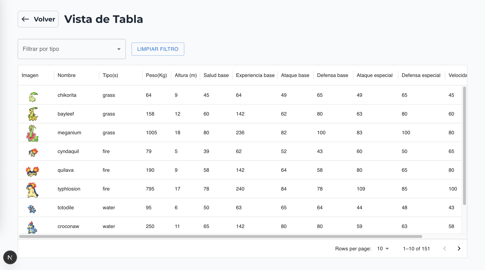
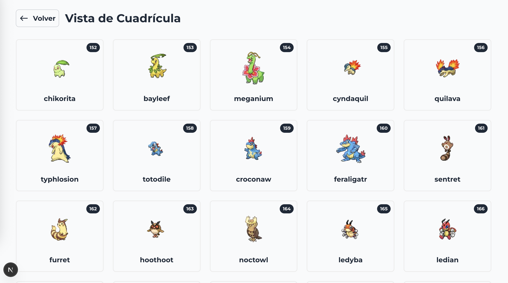
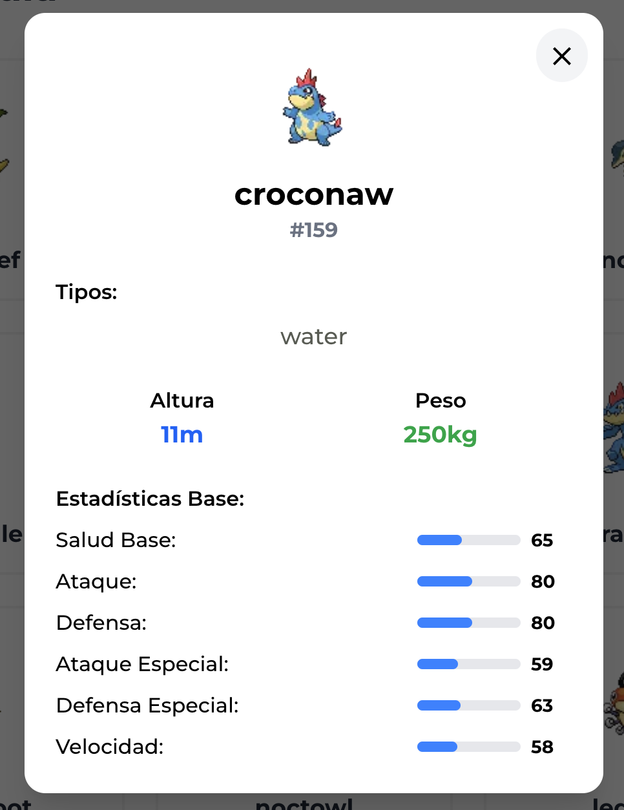

# Pokemón Explorer

Este proyecto es una aplicación para explorar información detallalda de cada Pokémon utilizando la API pública de PokéAPI.

## Características

- Visualiación de los datos por medio de una tabla y de una cuadrícula.
- En la vista de la Tabla se puede filtrar por tipo(s) de Pokémon, ordenar los diferentes campos y paginar.
- En la vista de la Cuadrícula se puede visualizar los datos de los Pokémones de forma más visual y atractiva.
- Visualización de detalles como tipo, habilidades y estadísticas por medio de un modal.
- Interfaz intuitiva y responsiva.

## Enlace de la aplicación

Puedes acceder a la aplicación desplegada en Vercel en el siguiente enlace: [Pokémon Explorer](https://pokemon-explorer-delta-eight.vercel.app/)

## Instalación y uso

### 1. Clona el repositorio

```bash
git clone git@github.com:Angela2201/pokemon-explorer.git
```

### 2. Accede al directorio del proyecto

```bash
cd pokemon-explorer
```

### 3. Instala las dependencias

```bash
npm install
```

### 4. Compila la aplicación

```bash
npm run build
```

### 5. Ejecuta servidor de la aplicación

```bash
npm run start
```

Abre [http://localhost:3000](http://localhost:3000) para ver la aplicación en tu navegador.

## Tecnologías utilizadas

- **TypeScript:** Lenguaje de programación fuertemente tipado que mejora la calidad y mantenibilidad del código.
- **Next.js:** Framework de React para el desarrollo de aplicaciones web optimizadas.
- **React:** Framework de JavaScript para construir interfaces de usuario interactivas y reutilizables.
- **Tailwind CSS:** Framework de CSS para el diseño, permitiendo una personalización rápida y eficiente.
- **headlessui/react:** Para la gestión de los modales.
- **mui/x-data-grid:** Para la implementación de la tabla.

## Imágenes de la aplicación

### Pantalla de inicio


### Pantalla de la vista de la Tabla



### Pantalla de la vista de la Cuadrícula



### Vista del modal con los detalles del Pokémon

  <!-- markdownlint-disable MD033 -->
